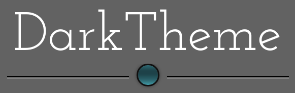

<!-- PROJECT LOGO -->
<br />
<p align="center">
  <a href="https://github.com/goldim/darktheme">
    
  </a>

  <h3 align="center"></h3>

  <p align="center">
    A theme for the Qooxdoo JavaScript Framework
  </p>
</p>

<!-- ABOUT THE PROJECT -->
## About The Project

This was my first theme contribution back in 2010 when qooxdoo 1.x was state of the art. At that time you had to use quite a number of graphical items in order to produce some kind of spatial impression in your GUI. Especially with a slow internet connection you'll find that initial rendering of many GUI elements in a «DarkTheme» application is noticeably delayed. But the longer the app is running, the less latency occurs ;-)

The «DarkTheme» you are currently looking at is not only a port to qooxdoo 3.0+, but it's also been slightly refurbished. This means that some widgets (CheckBox, RadioButton, Slider, TabView, Window) now come with "modernized" decorators, the general look & feel of the theme, however, should have been preserved.

**Form Controls**


<!-- GETTING STARTED -->
## Using the Theme in your Application
To use the Theme in your application, go into the application root directory and install the theme into your project:
```sh
$ qx package update
$ qx package list
$ qx package install goldim/darktheme
```
now you just have to modify your compile.json to enable the theme:
```sh
"applications": [
  {
    ...
    "theme": "darktheme.theme.Theme",
    ...
  }
],
```

<!-- DEMOS -->
## Demo
Using Qooxdoos [WidgetBrowser](http://qooxdoo.org/qxl.packagebrowser/qxl.packagebrowser/demos/goldim/darktheme/widgetbrowser/)

<!-- ROADMAP -->
## Roadmap

TBD


<!-- LICENSE -->
## License

Distributed under the MIT License. See `LICENSE` for more information.


<!-- CONTACT -->
## Contact

Norbert Schröder - [@scro34](http://scro34.de/) - email: n.schroeder@scro34.de
